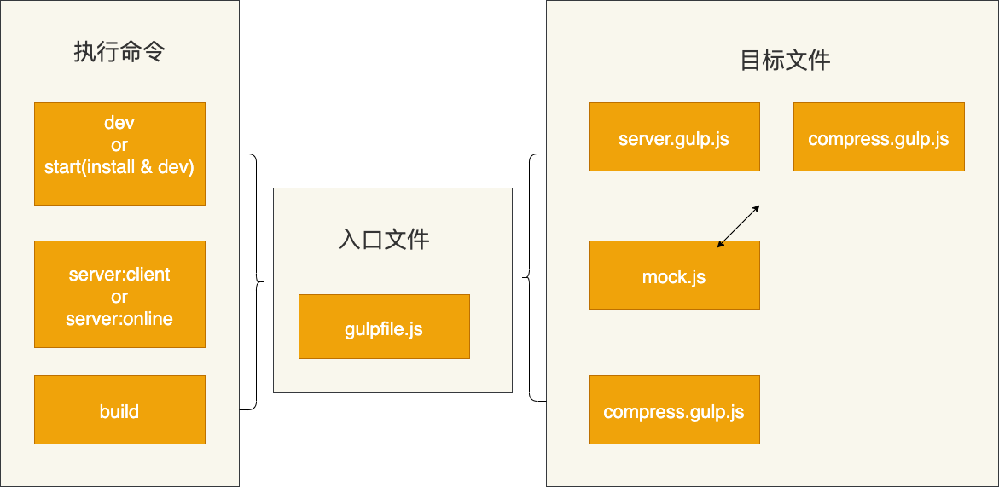

## 编译入口
模板的编译入口文件是gulpfile.js，该文件放在项目目录的根目录下。执行所有命令时，都会从该文件开始，然后根据具体的命令，运行相应的文件，命令主要分为三大类：
- dev：编译并启动一个本地服务监听文件修改，在编译，包括npm run dev、npm run start；
- mock：启动一个本地MOCK服务器，包括npm run server:client、npm run server:online；
- build：仅编译，包括npm run build；



命令行对应的package.json中的scripts配置如下：
```json
"scripts": {
    "dev": "gulp dev",
    "start": "npm install && gulp dev",
    "server:client": "gulp mock --NODE_ENV clientMock",
    "server:online": "gulp mock --NODE_ENV onlineMock",
    "build": "gulp build"
}
```

## 编译实现
处理编译的主要文件是：compress.gulp.js，该文件在项目目录的根目录下的build/目录下。

- 命令行
```sh
npm run build
或者 
npm run dev
```
- 读取配置文件，主要读取[模板配置文件](/config#模板配置文件)中的：
  - pxtorpx：在编译文件中，先赋值给plugins


