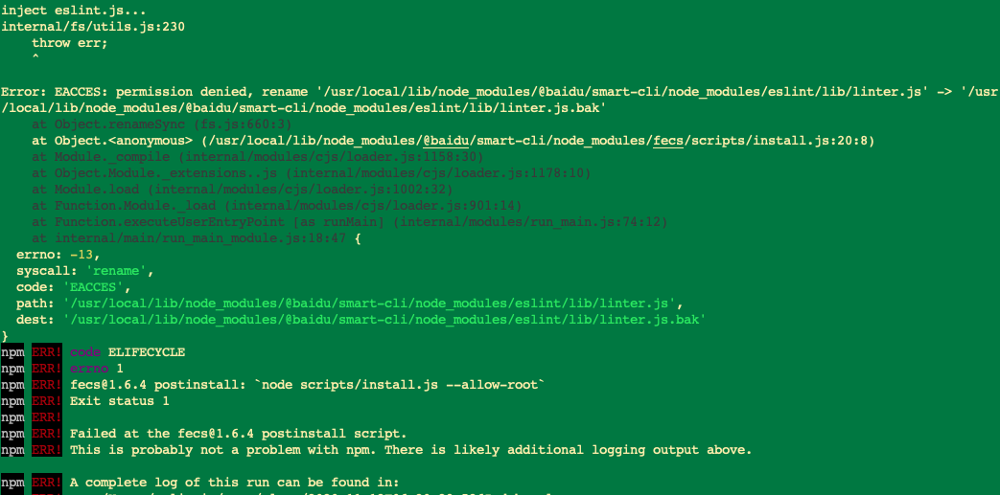

# 常见问题
## CLI安装不成功
1. **npm安装源registry设置错误，引起安装不成功**

处理方案可参考：
> - 通过config命令
> ```sh
> npm config set registry http://registry.npm.baidu-int.com
> ```
> - 修改.npmrc文件
> ```sh
> # .npmrc
> registry=http://registry.npm.baidu-int.com
> ```
> - 安装时使用 --registry
> ```sh
> $ sudo npm install -g @baidu/smart-cli --registry=http://registry.npm.baidu-int.com
> ```
> - 使用[nrm](https://www.npmjs.com/package/nrm)管理工具管理registry地址
> ```sh
> npm install -g nrm
> nrm add baidu http://registry.npm.baidu-int.com
> nrm use baidu
> ```
2. **由fecs设置引起的安装不成功**

具体问题提示可能如下：



处理方案可参考：
> ```sh
> npm config set unsafe-perm=true
> sudo npm install fecs -g
> sudo npm install -g @baidu/smart-cli --registry=http://registry.npm.baidu-int.com
> ```
